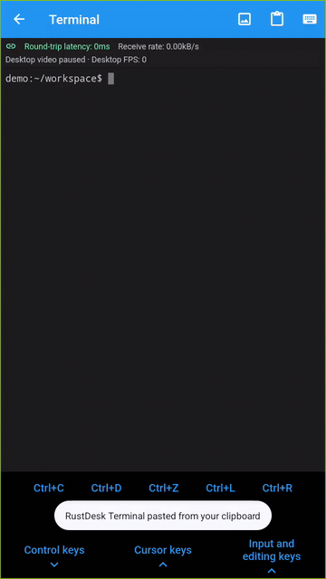
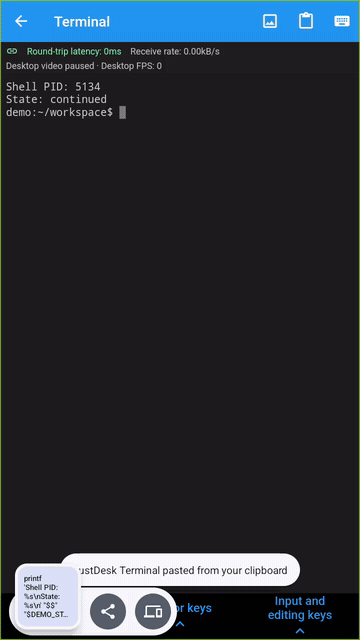
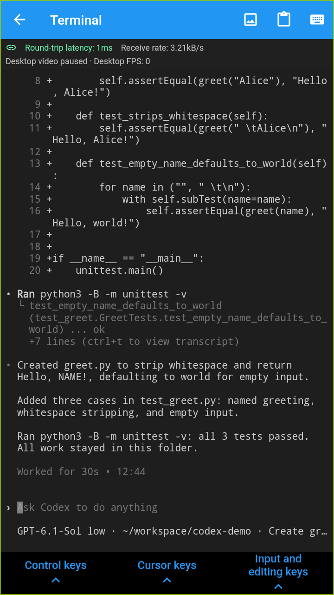
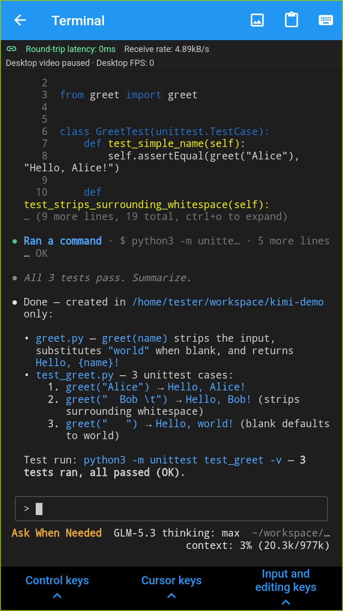

<p align="center">
  <br>
  <a href="#raw-steps-to-build">Build</a> •
  <a href="#how-to-build-with-docker">Docker</a> •
  <a href="#file-structure">Structure</a> •
  <a href="#screenshots">Screenshots</a><br>
  [<a href="docs/README-UA.md">Українська</a>] | [<a href="docs/README-CS.md">česky</a>] | [<a href="docs/README-ZH.md">中文</a>] | [<a href="docs/README-HU.md">Magyar</a>] | [<a href="docs/README-ES.md">Español</a>] | [<a href="docs/README-FA.md">فارسی</a>] | [<a href="docs/README-FR.md">Français</a>] | [<a href="docs/README-DE.md">Deutsch</a>] | [<a href="docs/README-PL.md">Polski</a>] | [<a href="docs/README-ID.md">Indonesian</a>] | [<a href="docs/README-FI.md">Suomi</a>] | [<a href="docs/README-ML.md">മലയാളം</a>] | [<a href="docs/README-JP.md">日本語</a>] | [<a href="docs/README-NL.md">Nederlands</a>] | [<a href="docs/README-IT.md">Italiano</a>] | [<a href="docs/README-RU.md">Русский</a>] | [<a href="docs/README-PTBR.md">Português (Brasil)</a>] | [<a href="docs/README-EO.md">Esperanto</a>] | [<a href="docs/README-KR.md">한국어</a>] | [<a href="docs/README-AR.md">العربي</a>] | [<a href="docs/README-VN.md">Tiếng Việt</a>] | [<a href="docs/README-DA.md">Dansk</a>] | [<a href="docs/README-GR.md">Ελληνικά</a>] | [<a href="docs/README-TR.md">Türkçe</a>] | [<a href="docs/README-NO.md">Norsk</a>] | [<a href="docs/README-RO.md">Română</a>]<br>
  <b>We need your help to translate this README, <a href="https://github.com/rustdesk/rustdesk/tree/master/src/lang">RustDesk UI</a> and <a href="https://github.com/rustdesk/doc.rustdesk.com">RustDesk Doc</a> to your native language</b>
</p>

## Mobile terminal fork: demos and differences

This is an experimental fork of [RustDesk](https://github.com/rustdesk/rustdesk), focused on using a remote Linux shell from Android, including command-line coding workflows. It is not an official RustDesk distribution. [中文说明](docs/README-ZH.md#本-fork-的区别与演示)

### Watch the fork in action

These are real Android emulator recordings connected to an isolated Linux VM. The shell commands, CI output and chart in the videos are deliberately created demo fixtures; the RTT, receive rate and desktop FPS are live connection values. The additional coding screenshots below show actual model calls in disposable projects, with authentication kept off-screen. No physical phone or personal project files are used.

| Terminal, grouped keys and image zoom | Keep a shell and resume it |
| --- | --- |
|  |  |
| [MP4 walkthrough](docs/assets/mobile-terminal/workflow.mp4) | [MP4 walkthrough](docs/assets/mobile-terminal/shell-resume.mp4) |

[Network interruption and reconnection video](docs/assets/mobile-terminal/network-reconnect.mp4) · [Screenshots, recording notes and reproduction steps](docs/mobile-terminal-demo.md)

#### Actual CLI coding sessions

Both tools generated `greet.py` and three Python unit tests, then ran the tests successfully on the remote Linux VM. These are real CLI screens viewed through the Android terminal, not simulated AI responses. Codex CLI 0.160.0 uses GPT-6.1-Sol; Kimi Code CLI 2.1.1 uses the locally configured GLM-5.3 provider, rather than a Kimi model. The tools and their accounts are separate from RustDesk.

| Codex: generated diff and passing tests | Kimi Code: generated code and passing tests |
| --- | --- |
| [](docs/assets/mobile-terminal/codex-result.png) | [](docs/assets/mobile-terminal/kimi-code-result.png) |

[Prompt and capture details](docs/mobile-terminal-demo.md#actual-codex-and-kimi-code-sessions--真实编程会话)

### What changes compared with upstream?

The comparison below is against this branch's upstream base, [`c9c0b5d0`](https://github.com/rustdesk/rustdesk/commit/c9c0b5d0efd44b364b31639f3c118e8adc42d98c), rather than a claim about every official release. That base already has a separate terminal connection and terminal session support; this fork now uses its enhanced terminal UI and channel for both in-desktop and standalone connections on compatible Linux/macOS hosts.

| Area | Upstream base | This fork |
| --- | --- | --- |
| Terminal entry | Separate **Terminal (beta)** connection | **Terminal** inside an authenticated desktop connection, or a direct terminal-only connection |
| Mobile interaction | Existing standalone terminal UI | Expandable **Control**, **Cursor**, and **Input and editing** groups; all four arrows, Home/End, Ctrl+C/D/Z, Tab and Enter |
| Image output | Existing terminal rendering | Tap a printed image path, or enter a path, to fetch a preview from the host; double-tap/pinch to zoom |
| Network feedback | Existing connection quality tools | Terminal status bar with RTT, total receive rate, desktop FPS and stale-latency feedback |
| Host resources | Existing host tools | Remote Linux RAM and root filesystem (`/`) usage at the top of the terminal, refreshed every five seconds |
| Desktop video | Existing desktop behavior | Suspend this connection's desktop video subscription while the terminal is open; restore it on return |
| Shell lifecycle | Existing standalone session behavior | Keep the same in-session shell after network loss; explicit exit offers **Cancel / Keep and exit / Destroy and exit** |
| Input delivery | Existing terminal input path | Acknowledged, ordered chunks for this channel; abort remaining input after a delivery failure; mobile IME activation on entry |

On compatible hosts, standalone connections use the same enhanced terminal as desktop sessions. Older hosts, unsupported platforms, web controllers and builds without `terminal-channel` keep the upstream standalone implementation. CLI coding agents are installed and run on the remote machine; this fork does not bundle an AI model, agent or API credentials.

### Try it

1. Update both the Android controller and the Linux controlled device to compatible fork builds. Upstream downloads linked further below do **not** contain these fork features.
2. Run the controlled device's server as the logged-in user and enable its terminal permission. The in-session shell refuses to run as root.
3. Connect to the desktop and open **⋮ → Terminal**, or connect directly with **Terminal (beta)** in the peer menu. On Android, the terminal icon beside the remote ID opens a terminal-only connection. Then type, paste or use the grouped shortcut buttons.
4. Click an image path such as `./build-report.png` to preview it. Use Back to choose whether the shell should remain running.

No `hbbs`/`hbbr` changes are required. Validation currently covers Android → Linux; other controller/host combinations are not claimed as tested.

### Standalone terminal connections

Standalone connections authenticate with terminal-only permissions and do not subscribe to desktop video. Both endpoints need compatible fork builds to select the enhanced channel. It uses the same logged-in user's login shell as the in-desktop terminal, rather than the legacy service shell environment.

The upstream desktop tab manager, mouse selection and application mouse reporting, bracketed paste, 10,000-line scrollback, and permission-controlled OSC 52 clipboard writes are retained. Shell titles appear in the terminal header; reconnecting a retained shell triggers a PTY resize so full-screen applications can redraw. Desktop connections support multiple independent shells (up to 32 per connection), with separate input acknowledgements, image responses and resume tokens. The **Retained shells** list button queries the host for resumable shells, showing PID and current directory. Listing requires terminal permission, the original controller ID, and a random credential retained in that controller’s local peer configuration; a self-reported ID alone cannot reveal another controller’s resume tokens. Existing cached resume tokens also provide proof for upgrading older retained shells. Choose one to restore it into a new desktop tab; on Android, switching keeps the current shell before attaching the selected one. **New shell** starts a fresh process. Shell identity is its resume token, independent of the tab number. Attached shells remain in their current tabs and do not appear in this resumable list. Both endpoints need the shell-list capability; older compatible hosts retain local tab restoration. Closing a tab or window asks whether to keep or destroy its shells; network loss retains them. Retention does not survive a host process restart.

Linux native module tests cover independent shell output/input acknowledgement routing, owner-filtered lists, restoring into a different terminal ID, and image response routing. macOS module checks run on both architectures; complete standalone desktop/mobile UI connections still need end-to-end validation.

### macOS controlled host branch

`feature/macos-terminal-host` adds experimental macOS host support to this fork. Both terminal entry points reuse the enhanced controller UI. The host uses a native PTY for the logged-in user's shell, resolves relative image paths through `proc_pidinfo` instead of Linux `/proc`, and reports RAM and root filesystem usage every five seconds. Existing authentication, terminal permission and shell retention rules apply; `hbbs`/`hbbr` do not need changes.

The [native host workflow](.github/workflows/macos-terminal-host.yml) checks these modules on Apple Silicon and Intel, including PTY input/resize, working-directory resolution, resource sampling and feature-disabled compilation. The recordings above remain Android → Linux demonstrations. A complete macOS app/DMG build, signing/notarization and Android → macOS end-to-end testing are still required before calling this a tested macOS release.

On macOS, RAM uses the existing `sysinfo` library's VM counters; it is not an Activity Monitor memory-pressure reading. Disk usage counts allocated space on `/`; APFS shared space, snapshots and purgeable space can differ from Finder's display. Both endpoints need compatible fork builds for resource readings.

### Current limits

- Shell retention survives network disconnection, not a restart of the controlled device's RustDesk process. Detached shells keep at most the latest 1 MiB of output each, with a truncation message; up to 100 detached shells are retained.
- Reconnection still requires authentication and terminal permission. Input interrupted by a connection failure is not automatically resent, to avoid duplicate commands.
- Desktop FPS can be zero while the terminal and image channel remain usable. The receive rate is for the whole connection, not just the terminal, and the emulator RTT is not an Internet performance benchmark.
- Resource indicators show the controlled Linux host, not the phone: used/total GiB and percentage. RAM usage excludes memory the [Linux kernel reports as available](https://www.kernel.org/doc/html/latest/filesystems/proc.html); disk usage counts allocated space on `/`, not every mounted drive or the shell's current directory. Missing, disconnected or stale readings show “—”. Update both the Android controller and Linux host for these readings; older hosts remain usable without them.
- Local fork builds have triggered a Vivo “privacy information theft” warning, including the signed Release build. The cause is unresolved; changing build mode/signature did not remove it. This fork has not been certified by Vivo or an app store.

The remaining project information and download links below are upstream references.


> [!Caution]
> **Misuse Disclaimer:** <br>
> The developers of RustDesk do not condone or support any unethical or illegal use of this software. Misuse, such as unauthorized access, control or invasion of privacy, is strictly against our guidelines. The authors are not responsible for any misuse of the application.


Chat with us: [Discord](https://discord.gg/nDceKgxnkV) | [Twitter](https://twitter.com/rustdesk) | [Reddit](https://www.reddit.com/r/rustdesk) | [YouTube](https://www.youtube.com/@rustdesk)

[](https://rustdesk.com/pricing.html)

Yet another remote desktop solution, written in Rust. Works out of the box with no configuration required. You have full control of your data, with no concerns about security. You can use our rendezvous/relay server, [set up your own](https://rustdesk.com/server), or [write your own rendezvous/relay server](https://github.com/rustdesk/rustdesk-server-demo).


RustDesk welcomes contribution from everyone. See [CONTRIBUTING.md](docs/CONTRIBUTING.md) for help getting started.

[**FAQ**](https://github.com/rustdesk/rustdesk/wiki/FAQ)

[**BINARY DOWNLOAD**](https://github.com/rustdesk/rustdesk/releases)

[**NIGHTLY BUILD**](https://github.com/rustdesk/rustdesk/releases/tag/nightly)

[](https://f-droid.org/en/packages/com.carriez.flutter_hbb)
[](https://flathub.org/apps/com.rustdesk.RustDesk)

## Dependencies

Desktop versions use Flutter or Sciter (deprecated) for GUI. This tutorial is for Sciter only, since it is easier and more friendly to start. Check out our [CI](https://github.com/rustdesk/rustdesk/blob/master/.github/workflows/flutter-build.yml) for building the Flutter version.

Please download Sciter dynamic library yourself.

[Windows](https://raw.githubusercontent.com/c-smile/sciter-sdk/master/bin.win/x64/sciter.dll) |
[Linux](https://raw.githubusercontent.com/c-smile/sciter-sdk/master/bin.lnx/x64/libsciter-gtk.so) |
[macOS](https://raw.githubusercontent.com/c-smile/sciter-sdk/master/bin.osx/libsciter.dylib)

## Raw Steps to build

- Prepare your Rust development env and C++ build env

- Install [vcpkg](https://github.com/microsoft/vcpkg), and set `VCPKG_ROOT` env variable correctly

  - Windows: vcpkg install libvpx:x64-windows-static libyuv:x64-windows-static opus:x64-windows-static aom:x64-windows-static
  - Linux/macOS: vcpkg install libvpx libyuv opus aom

- run `cargo run`

## [Build](https://rustdesk.com/docs/en/dev/build/)

## How to Build on Linux

### Ubuntu 18 (Debian 10)

```sh
sudo apt install -y zip g++ gcc git curl wget nasm yasm libgtk-3-dev clang libxcb-randr0-dev libxdo-dev \
        libxfixes-dev libxcb-shape0-dev libxcb-xfixes0-dev libasound2-dev libpulse-dev cmake make \
        libclang-dev ninja-build libgstreamer1.0-dev libgstreamer-plugins-base1.0-dev
```

### openSUSE Tumbleweed

```sh
sudo zypper install gcc-c++ git curl wget nasm yasm gcc gtk3-devel clang libxcb-devel libXfixes-devel cmake alsa-lib-devel gstreamer-devel gstreamer-plugins-base-devel xdotool-devel
```

### Fedora 28 (CentOS 8)

```sh
sudo yum -y install gcc-c++ git curl wget nasm yasm gcc gtk3-devel clang libxcb-devel libxdo-devel libXfixes-devel pulseaudio-libs-devel cmake alsa-lib-devel gstreamer1-devel gstreamer1-plugins-base-devel
```

### Arch (Manjaro)

```sh
sudo pacman -Syu --needed unzip git cmake gcc curl wget yasm nasm zip make pkg-config clang gtk3 xdotool libxcb libxfixes alsa-lib pipewire
```

### Install vcpkg

```sh
git clone https://github.com/microsoft/vcpkg
cd vcpkg
git checkout 2023.04.15
cd ..
vcpkg/bootstrap-vcpkg.sh
export VCPKG_ROOT=$HOME/vcpkg
vcpkg/vcpkg install libvpx libyuv opus aom
```

### Fix libvpx (For Fedora)

```sh
cd vcpkg/buildtrees/libvpx/src
cd *
./configure
sed -i 's/CFLAGS+=-I/CFLAGS+=-fPIC -I/g' Makefile
sed -i 's/CXXFLAGS+=-I/CXXFLAGS+=-fPIC -I/g' Makefile
make
cp libvpx.a $HOME/vcpkg/installed/x64-linux/lib/
cd
```

### Build

```sh
curl --proto '=https' --tlsv1.2 -sSf https://sh.rustup.rs | sh
source $HOME/.cargo/env
git clone --recurse-submodules https://github.com/rustdesk/rustdesk
cd rustdesk
mkdir -p target/debug
wget https://raw.githubusercontent.com/c-smile/sciter-sdk/master/bin.lnx/x64/libsciter-gtk.so
mv libsciter-gtk.so target/debug
VCPKG_ROOT=$HOME/vcpkg cargo run
```

## How to build with Docker

Begin by cloning the repository and building the Docker container:

```sh
git clone https://github.com/rustdesk/rustdesk
cd rustdesk
git submodule update --init --recursive
docker build -t "rustdesk-builder" .
```

Then, each time you need to build the application, run the following command:

```sh
docker run --rm -it -v $PWD:/home/user/rustdesk -v rustdesk-git-cache:/home/user/.cargo/git -v rustdesk-registry-cache:/home/user/.cargo/registry -e PUID="$(id -u)" -e PGID="$(id -g)" rustdesk-builder
```

Note that the first build may take longer before dependencies are cached, subsequent builds will be faster. Additionally, if you need to specify different arguments to the build command, you may do so at the end of the command in the `<OPTIONAL-ARGS>` position. For instance, if you wanted to build an optimized release version, you would run the command above followed by `--release`. The resulting executable will be available in the target folder on your system, and can be run with:

```sh
target/debug/rustdesk
```

Or, if you're running a release executable:

```sh
target/release/rustdesk
```

Please ensure that you run these commands from the root of the RustDesk repository, or the application may not find the required resources. Also note that other cargo subcommands such as `install` or `run` are not currently supported via this method as they would install or run the program inside the container instead of the host.

## File Structure

- **[libs/hbb_common](https://github.com/rustdesk/rustdesk/tree/master/libs/hbb_common)**: video codec, config, tcp/udp wrapper, and some other utility functions shared with the server
- **[libs/base](https://github.com/rustdesk/rustdesk/tree/master/libs/base)**: protobuf, fs functions for file transfer, keyboard and platform code used only by this app
- **[libs/scrap](https://github.com/rustdesk/rustdesk/tree/master/libs/scrap)**: screen capture
- **[libs/enigo](https://github.com/rustdesk/rustdesk/tree/master/libs/enigo)**: platform specific keyboard/mouse control
- **[libs/clipboard](https://github.com/rustdesk/rustdesk/tree/master/libs/clipboard)**: file copy and paste implementation for Windows, Linux, macOS.
- **[src/ui](https://github.com/rustdesk/rustdesk/tree/master/src/ui)**: obsolete Sciter UI (deprecated)
- **[src/server](https://github.com/rustdesk/rustdesk/tree/master/src/server)**: audio/clipboard/input/video services, and network connections
- **[src/client.rs](https://github.com/rustdesk/rustdesk/tree/master/src/client.rs)**: start a peer connection
- **[src/rendezvous_mediator.rs](https://github.com/rustdesk/rustdesk/tree/master/src/rendezvous_mediator.rs)**: Communicate with [rustdesk-server](https://github.com/rustdesk/rustdesk-server), wait for remote direct (TCP hole punching) or relayed connection
- **[src/platform](https://github.com/rustdesk/rustdesk/tree/master/src/platform)**: platform specific code
- **[flutter](https://github.com/rustdesk/rustdesk/tree/master/flutter)**: Flutter code for desktop and mobile

## Screenshots


