# Mobile terminal demos / 手机终端演示

[English overview and upstream comparison](../README.md#mobile-terminal-fork-demos-and-differences) · [中文介绍与官方基线对比](README-ZH.md#本-fork-的区别与演示)

These recordings show the actual fork UI and an authenticated connection, captured on 2026-10-07 from feature commit `38502eaf9`. The controller is an Android 35 x86_64 emulator at 720 × 1280; the host is an isolated Linux VM running RustDesk as an ordinary user. No physical phone is required. The commands and build chart are sample fixtures, not a real CI run or AI benchmark. Videos have no audio.

这些素材来自真实模拟器操作与远程 shell，不是界面模型。基础视频中的工作区及图表均为样例；下方新增编程会话使用真实模型调用。网络读数来自实际连接，没有录入个人项目，认证信息没有进入截图。

## Actual Codex and Kimi Code sessions / 真实编程会话

Captured on 2026-10-07 through the same Android emulator and isolated Linux host. Codex CLI **0.160.0 / GPT-6.1-Sol** and Kimi Code CLI **2.1.1 / GLM-5.3** worked in separate scratch directories. The Kimi screenshot demonstrates the **Kimi Code application with a configured third-party model**, not a comparison of Kimi and OpenAI models. Both CLIs actually wrote Python files and ran three tests successfully; the generated tests were independently rerun and passed. These screenshots are not a quality or latency benchmark.

本次新增截图展示真实的模型生成结果，不是预先编写的 CI 输出。两款工具各自生成代码与测试，随后分别复跑三个测试，均通过。只使用样例文件；账号配置放在项目目录外，录制从登录配置完成后开始。CLI 通过 tmux 运行，可从手机终端查看其交互画面。

Prompt used in both projects:

```text
Create greet.py: greet(name) returns 'Hello, NAME!' (strip, empty=world).
Add 3 unittest cases, run tests, summarize. Only work in this folder.
```

| Codex result / 生成结果 | Kimi Code result / 生成结果 |
| --- | --- |
| [](assets/mobile-terminal/codex-result.png) | [](assets/mobile-terminal/kimi-code-result.png) |

To repeat, install and authenticate the CLIs on your own controlled Linux host, create two disposable folders, and send the prompt from Terminal. If your network needs a proxy, set `https_proxy` before starting Codex; the demonstration verified both `https_proxy` and `HTTPS_PROXY` in the resumed process. Keep credentials outside the sample folders and authentication screens outside your captures. See the [official Codex CLI documentation](https://learn.chatgpt.com/docs/codex/cli) and [Kimi Code documentation](https://moonshotai.github.io/kimi-code/) for each tool's setup. RustDesk does not install or configure either CLI.

## Walkthroughs / 视频

| Recording | What to watch | Formats |
| --- | --- | --- |
| Terminal workflow | Expand the three shortcut groups, paste and run a sample command, tap a PNG path, double-tap to zoom, reset and return | [GIF](assets/mobile-terminal/workflow.gif) · [MP4](assets/mobile-terminal/workflow.mp4) |
| Keep and resume | Choose **Keep and exit**, return to the desktop, reopen Terminal, verify the same shell PID and exported variable | [GIF](assets/mobile-terminal/shell-resume.gif) · [MP4](assets/mobile-terminal/shell-resume.mp4) |
| Network recovery | Temporarily drop traffic, observe stale latency, reset the connection, restore traffic and check the same shell state | [GIF](assets/mobile-terminal/network-reconnect.gif) · [MP4](assets/mobile-terminal/network-reconnect.mp4) |

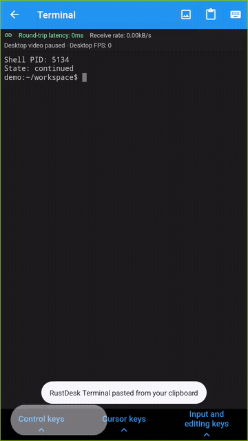

The network demo deliberately interrupts only the VM's RustDesk port; SSH remains available for cleanup. Recovery is tested before the host process restarts. RTT rounds to 0 ms on this local virtual network; this is not a claim of zero network delay. The status bar reports desktop video paused and FPS 0 while commands continue to work. Receive rate includes all connection traffic, so it can remain nonzero.

断网演示只阻断隔离虚拟机的 RustDesk 端口，恢复后 shell PID `5134` 和 `DEMO_STATE=continued` 均保持不变。本地虚拟网络的 RTT 显示可能四舍五入为 0 ms，不能当作公网性能结果。终端里桌面视频显示暂停、FPS 为 0，但终端与图片传输仍可工作，接收速率因此不一定为零。

## Screenshots / 截图

Click an image to inspect the original 720 × 1280 capture. 点击图片可查看原始分辨率。

| Control keys / 控制 | Cursor keys / 光标 | Input and editing / 输入与编辑 |
| --- | --- | --- |
| [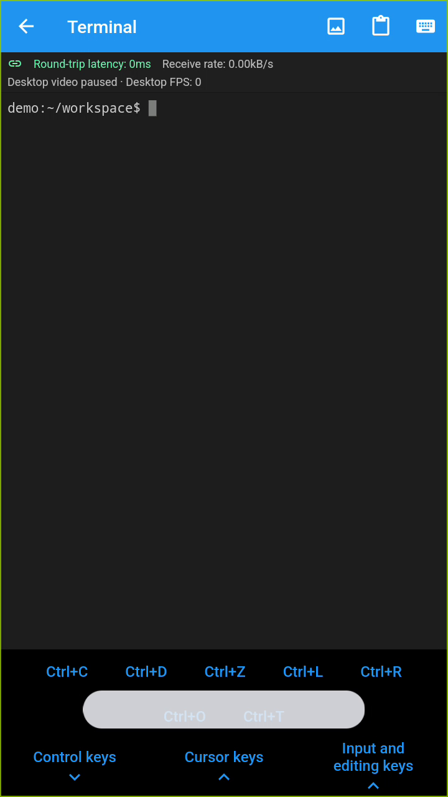](assets/mobile-terminal/shortcuts-control.png) | [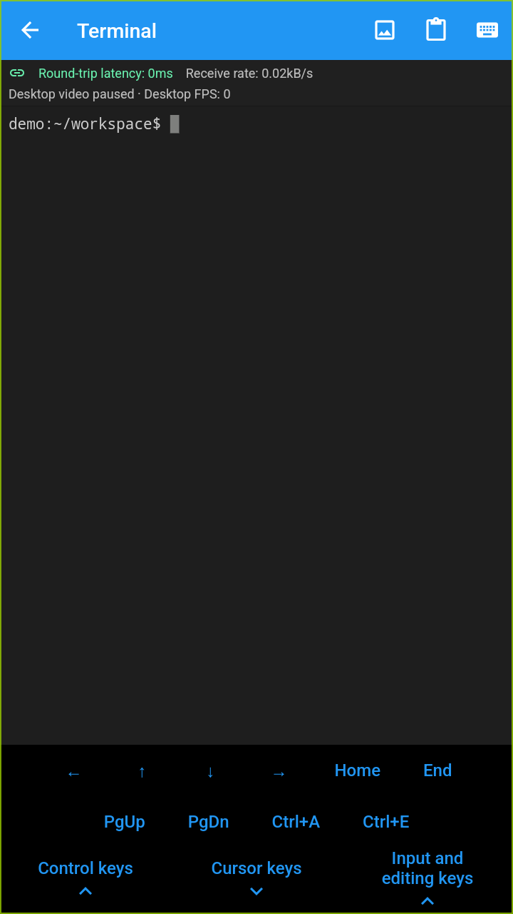](assets/mobile-terminal/shortcuts-cursor.png) | [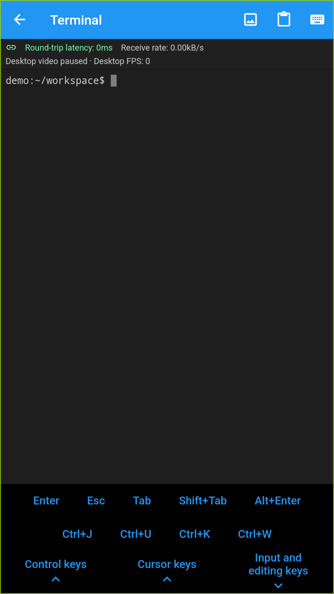](assets/mobile-terminal/shortcuts-editing.png) |

| Sample workflow / 示例输出 | Image preview / 图片预览 | Zoom / 放大 |
| --- | --- | --- |
| [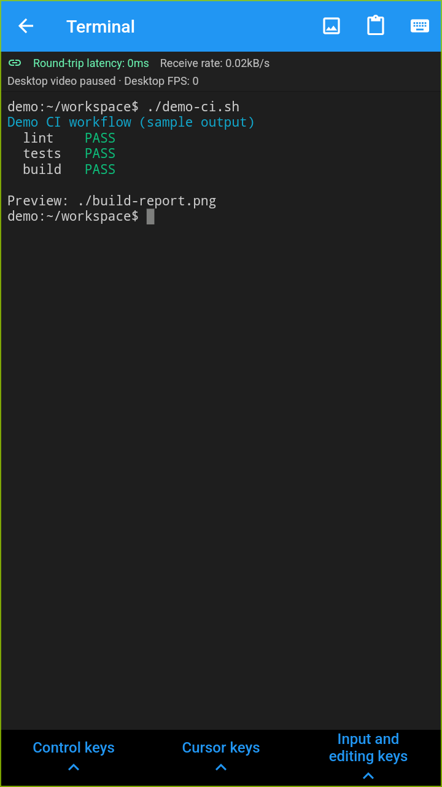](assets/mobile-terminal/terminal-workflow.png) | [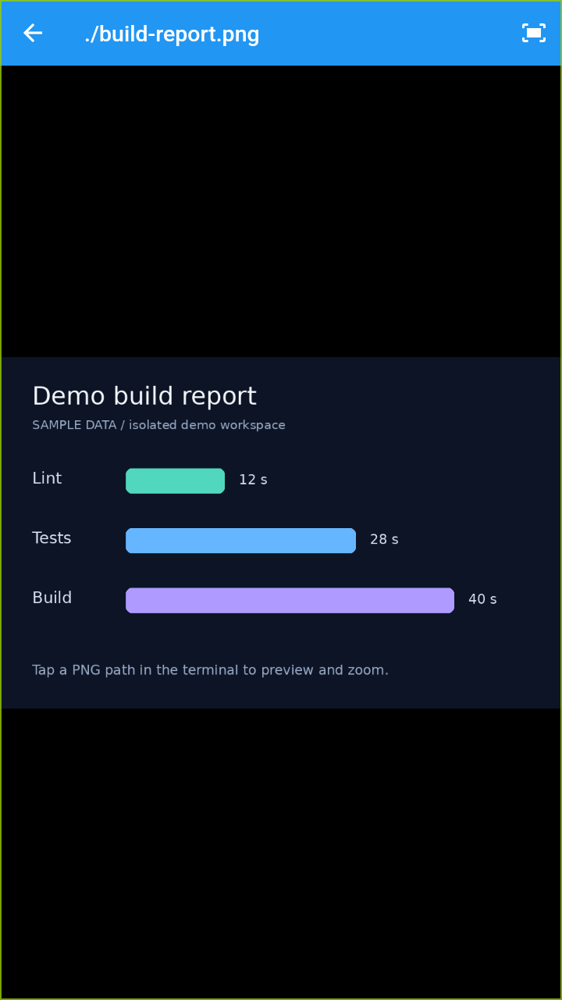](assets/mobile-terminal/image-preview.png) | [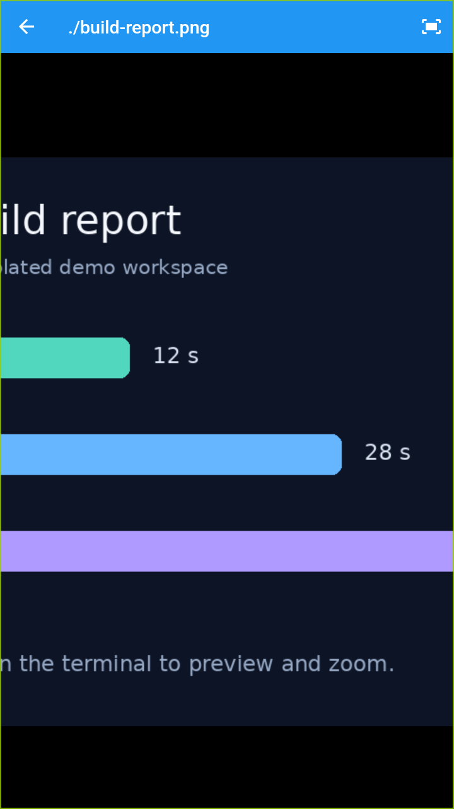](assets/mobile-terminal/image-zoom.png) |

| Explicit exit / 主动退出 | Kept shell / 保留后续接 |
| --- | --- |
| [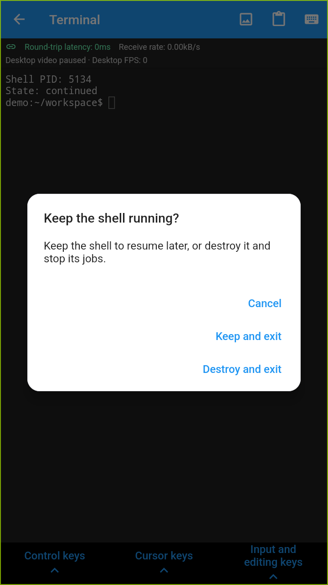](assets/mobile-terminal/shell-exit-choice.png) | [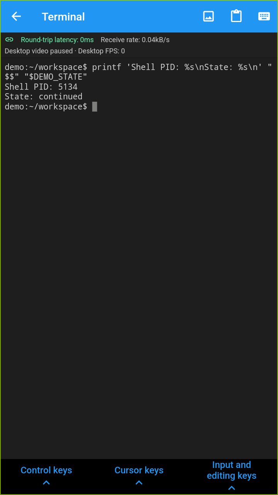](assets/mobile-terminal/shell-resumed.png) |

| Stale latency / 延迟失效 | Connection reset / 连接中断 | Reconnected / 恢复 |
| --- | --- | --- |
| [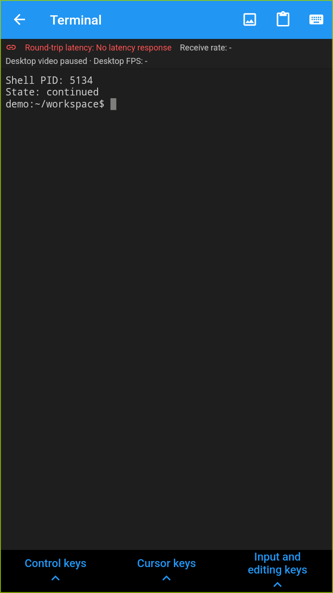](assets/mobile-terminal/network-no-response.png) | [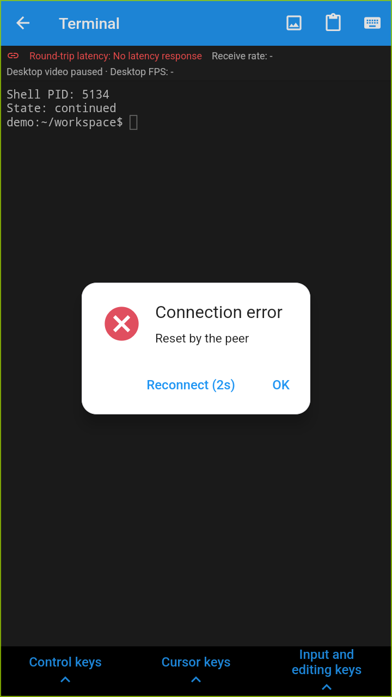](assets/mobile-terminal/network-disconnected.png) | [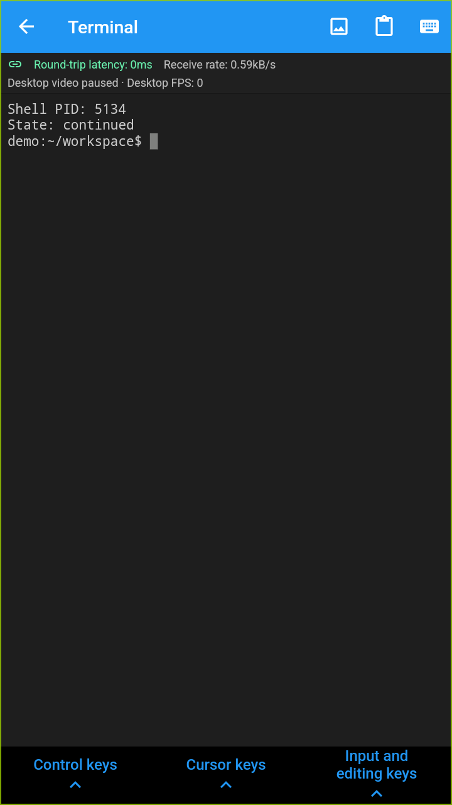](assets/mobile-terminal/network-resumed.png) |

## Reproduce / 复现

1. Build matching Android and Linux versions of this fork. Use a fresh emulator and a disposable Linux account or VM. Enable the host's terminal permission and run its RustDesk server as a non-root user.
2. Connect from the emulator to the Linux desktop. If using a forwarded host port, Android's `10.0.2.2` addresses the emulator host. Authenticate before recording, then open **⋮ → Terminal**.
3. Prepare a scratch directory containing any non-sensitive PNG, such as `build-report.png`. Run `printf 'Preview: ./build-report.png\n'`, tap the path and try double-tap or pinch zoom. Expand **Control**, **Cursor**, and **Input and editing** to inspect the available keys.
4. Run `export DEMO_STATE=continued; printf 'Shell PID: %s\nState: %s\n' "$$" "$DEMO_STATE"`. Choose **Keep and exit**, reopen Terminal and repeat the `printf` command. The PID and variable should match. **Destroy and exit** stops that shell and its jobs.
5. To check network recovery, interrupt only the disposable VM's RustDesk traffic, restore it, reconnect and repeat the state check. Keep another administrative route available and always remove temporary rules. Do not restart the host RustDesk process during this test.
6. Capture with `adb -s EMULATOR_SERIAL shell screenrecord --bit-rate 1500000 /sdcard/demo.mp4`, stop recording and pull the file with `adb`. Use `adb exec-out screencap -p` for PNG screenshots. Crop or exclude authentication/configuration screens before publishing.

For limitations, update requirements and the unresolved Vivo detection warning, see the linked overview. This documentation change adds media only; it does not change runtime behavior.
